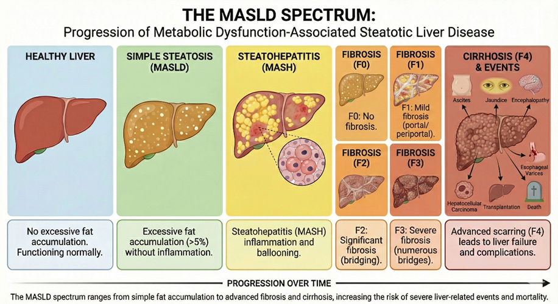

# ANNITIA: risk stratification of metabolic dysfunction-associated steatotic liver disease (MASLD) through AI

The objective is to develop a risk stratification score to predict liver events related to the progression of MASLD based on non-invasive tests (NITs) repeated over time. Understanding how the trajectories of repeat NITs are associated with the disease progression is crucial for improving the current epidemiological surveillance for MASLD and for better personalizing the patients follow-up healthcare.

This project is supported by France 2030 in partnership with the Health Data Hub.

## The vision behind ANNITIA

Metabolic dysfunction-associated steatotic liver disease (MASLD) is characterized by excessive fat accumulation in the liver that occurs without high alcohol consumption and affects approximately 30% of the worlds population. The spectrum of the disease ranges from simple steatosis to more advancing forms, including steatohepatitis (MASH  steatosis accompanied by inflammation and ballooning), that when persistent leads to the formation of scar tissue, known a fibrosis. Liver fibrosis is graded on a scale from F0 to F4 indicating, respectively, the absence of fibrosis to the most advanced stage  cirrhosis. The final stage of liver fibrosis (F4) increases the risk of liver-related events, such as ascites (fluid in the abdomen), jaundice (yellowing of the skin/eyes), or hepatic encephalopathy, esophageal varices (bleeding), hepatocellular carcinoma, liver transplantation, as well as death.

Therefore, liver fibrosis is a key factor contributing to poor outcomes in patients with MASLD. Detecting fibrosis in its earlier stages offers the best chance to slow, stop, or even reverse damage. Additionally, MASLD is closely linked not only to liver-specific complications but also to a wide range of cardiometabolic comorbidities, notably type 2 diabetes, elevated blood pressure and dyslipidemia. Thus, early identification of patients at risk of MASLD progression is critical for preventing long-term hepatic and cardiometabolic complications.

Currently, however, early detection of forms of steatohepatitis with advanced fibrosis remains a major clinical challenge, particularly in large cohorts of patients with metabolic comorbidities. This highlights the importance of developing more effective risk stratification tools before severe liver complications arise.

Furthermore, the progression of MASLD can vary from one patient to another. Therefore, early detection of patients at risk of progressing to more advanced stages of the disease using NIBTs is a crucial area of research in hepatology. Although liver histology is recognized as the gold standard for the definitive diagnosis of MASH and fibrosis, its invasive and costly nature, as well as its inter- and intra-observer variability, has always been an obstacle to epidemiological studies and therapeutic trials. It is therefore of the utmost importance to understand the value of NITs as a complementary tool or replacement for liver biopsy.

The diagnostic performance of NITs correlates with histological stages of fibrosis in cross-sectional settings, and they do not detect progressive forms of metabolic steatohepatitis. The focus is now on understanding how the trajectories of repeated NITs measurements over time are associated with disease progression or regression, as well as predicting the occurrence of long-term liver-related clinical events. Consequently, the development of NITs that could better identify patients at risk of MASLD progression would allow for better targeting of these patients with more systematic screening and more effective management, while also enabling modeling of the natural history of the disease.

## The Challenge: liver-related events predicted through Non-Invasive Tests (NIT)

The goal of the ANNITIA challenge is to use clinical data and non-invasive tests (NITs), such as FibroScan, FibroTest, and Aixplorer, to develop a score able to predict the occurrence of major liver events or death during the follow-up of patients with MASLD.

The competitors will have access to data from 1,676 synthetic patients. The dataset includes:

    Clinical data: age at baseline, gender, BMI (during follow-up), and medical history (diabetes, hypertension, dyslipidemia and bariatric surgery).
    Biochemical parameters (from baseline to follow-up): repeated measurements of ALT, AST, GGT, bilirubin, platelets, glycemia, triglycerides, total-cholesterol.
    Biomarkers (NIT, from baseline to follow-up): repeated measurements of FibroTest, FibroScan and Aixplorer.
    Outcomes: occurrence of major liver events and all-cause mortality.

### Building a comprehensive dataset

A critical component of this challenge is the creation of a large dataset of patients with MASLD including a long-term follow-up (from 2001 to 2025) containing repeated measurements of different NITs over time.

The ANNITIA team has explored the clinical records of thousands of patients (who allowed it) at Pitié-Salpêtrière Hospital in Paris. In order to protect patients from any reidentification risks, synthetic data were created from the original clinical database. Thus, the following dataset features for each synthetical patient are available:

    - 22 data points describing the patient over time of each examen performed, with the corresponding age, BMI and biochemical parameters.
    - Up to 3 NITs usually measured for assessing fibrosis progression.
    - One outcome column summarizing the liver-related events (composite endpoint) occurred by the patient during the follow-up and the time of the diagnosis: to be predicted.
    - One outcome column informing the death status (all-cause mortality): to be predicted.

This extended dataset provides an ideal foundation for training and evaluating machine learning models, offering participants a great opportunity to work with synthetic data generated from real-world medical data.